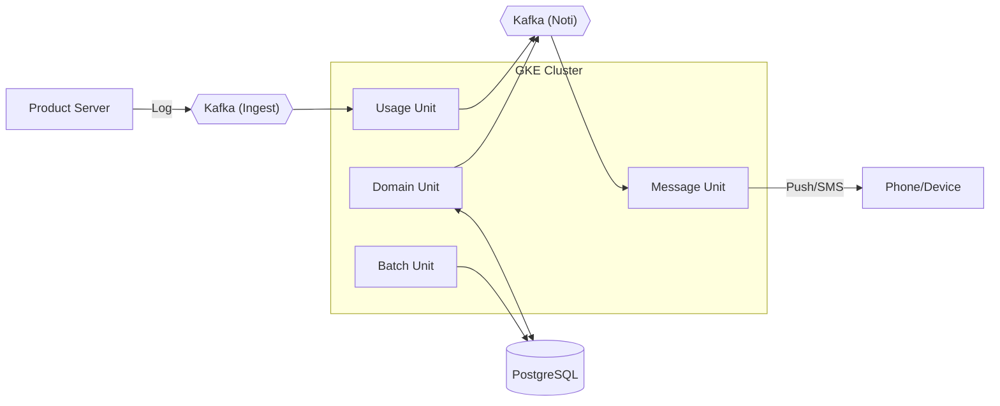
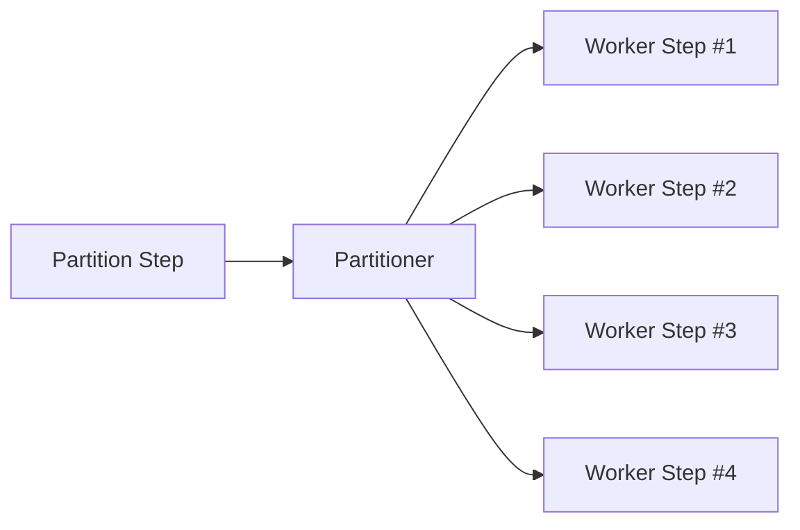
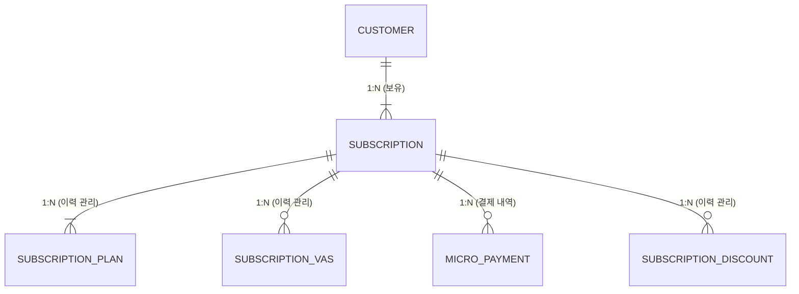

# Message Platform - 통신 서비스 메시지 플랫폼

## 프로젝트 개요

**Message Platform**은 100만 사용자 규모의 통신 서비스를 위한 **마이크로서비스 기반 메시지 플랫폼**입니다.

대용량 트래픽 처리, 실시간 데이터 사용량 모니터링, 월별 정산 및 알림 발송을 핵심 기능으로 제공합니다.

### 핵심 요구사항

- **100만 개 회선**의 동시 데이터 사용 지원
- 수 초 단위로 발생하는 데이터 사용 이벤트 처리
- 월 기준 **50% / 80% / 100%** 임계치 초과 시 1회 알림 발송
- Kafka 재시도, Consumer 재시작 상황에서도 **중복 집계·중복 알림 방지**
- 월 변경 시 이전 데이터 자동 정리

---

## 기술 스택

| 분류 | 기술 |
|------|------|
| Language | Java 17 |
| Framework | Spring Boot 3.x, Spring Batch |
| Database | PostgreSQL, InfluxDB |
| Cache/Store | Redis (실시간 집계용) |
| Message Broker | Apache Kafka |
| Infrastructure | GCP (GKE, Cloud SQL, GCS) |
| Monitoring | Grafana + Loki + Prometheus + Tempo (LGTM Stack) |
| Security | AES-256 Encryption |
| Build Tool | Gradle |

---

## 시스템 아키텍처

### 전체 구조



### 서비스 유닛 (Namespaces)

| Unit | Namespace | 역할 | 주요 컴포넌트 |
|------|-----------|------|---------------|
| **Unit 1: Usage** | `usage` | 대용량 트래픽 수집 및 가공 | Usage API, Kafka Consumer, InfluxDB, Redis |
| **Unit 2: Message** | `message` | 알림(SMS/Push) 발송 및 결과 처리 | Message API, Redis (Rate Limit) |
| **Unit 3: Domain** | `domain` | 통합 관리자 포털 및 사용자 기능 | Web GUI, Domain API |
| **Unit 4: Batch** | `batch` | 월 단위 대용량 정산 및 청구서 생성 | Spring Batch, CronJob |

---

## 핵심 시스템 상세

### 1. 데이터 사용량 관측 시스템

100만 회선의 실시간 데이터 사용량을 집계하고 임계치 초과 시 알림을 발송합니다.

#### Data Flow

```
Data Usage Event Producer (회선마다 데이터 사용량 이벤트 발생)
        ↓
Kafka (usage_topic)
        ↓
Usage Aggregation Consumer (Batch)
        ↓
Redis (월별 집계 & 임계치 판단)
        ↓
Threshold 초과 이벤트만 선별
        ↓
Kafka (notification_topic)
```

#### Redis 키 설계

```
usage:{yyyyMM}:{subscriptionId}      # 월별 누적 사용량
processed:{yyyyMM}:{subscriptionId}  # Kafka 이벤트 중복 방지
th:{yyyyMM}:{subscriptionId}         # 임계치 상태 (0/50/80/100)
limit:{subscriptionId}               # 회선별 월 사용 가능량
```

#### 왜 Redis인가?

- **초당 약 200,000 이벤트** 처리 필요 (100만 회선 / 5초)
- RDB 사용 시 Row Lock, Write Amplification 문제 발생
- Redis Lua 스크립트로 **원자적 트랜잭션** 처리
- `SETNX`, `SETBIT`으로 **중복 알림 방지 보장**

---

### 2. 배치 시스템 (정산)

Spring Batch 기반으로 월별 청구내역 생성 및 정산을 처리합니다.

#### 배치 선택 이유

| 구분 | 스케줄러 | Spring Batch |
|------|----------|--------------|
| 장애 발생 시 | 처음부터 재실행 | **실패 지점부터 재시작** |
| 실행 이력 | 수동 관리 | 자동 관리 |
| 모니터링 | 별도 구축 필요 | 내장 지원 |

#### 처리 구조



- **PagingItemReader**: Chunk 단위 커넥션 반환으로 DB 부하 최소화
- **PartitionStep**: 데이터 범위 분할 및 병렬 처리
- **Redis Aggregation**: 중간 집계 결과 메모리 처리

---

### 3. Core Domain API

유저 정보, 회선 관리, 요금제, 부가서비스, 할인 서비스를 관리합니다.

#### 도메인 구조



#### 핵심 기능

| 기능 | 설명 |
|------|------|
| **신규 개통** | 기존 번호 복구 또는 신규 번호 채번 자동 판단 |
| **요금제 변경** | 기존 이력 만료 → 신규 이력 생성 (이력 기반 관리) |
| **할인 관리** | 회선 단위 할인 등록/해지 이력 관리 |
| **개인정보 보호** | AES-256-CBC 암호화 (동일 평문 → 다른 암호문) |

---

### 4. 메시지 템플릿 시스템

SMS/이메일 템플릿을 저장하고 변수 치환을 통해 메시지를 생성합니다.

#### 템플릿 구조

```sql
templates (
    id, name, channel, subject, body,
    variables JSON, status, version,
    created_at, updated_at
)
```

#### 변수 치환 방식

```javascript
// 템플릿
"안녕하세요 {{user_name}}님, {{date}}에 예약하신 {{service_name}} 일정이 있습니다."

// 렌더링
renderTemplate(template, { user_name: "민수", date: "2026-01-10", service_name: "건강검진" })
```

#### 버전 관리 전략

- 템플릿 수정 시 **새 버전 생성** (덮어쓰기 금지)
- 예약된 메시지는 **특정 버전 참조**
- 운영 중 수정 리스크 최소화

---

## 모니터링 (Observability)

### LGTM Stack 구성

| 구성요소 | 역할 |
|----------|------|
| **Grafana Alloy** | GKE 노드에 DaemonSet으로 배포, 로그/메트릭/트레이스 수집 |
| **Loki** | JSON 로그 수집 및 쿼리 |
| **Prometheus** | Spring Boot Actuator 메트릭 수집 |
| **Tempo** | 분산 트레이싱 (OTLP 기반) |
| **Grafana** | 통합 대시보드 시각화 |

### 텔레메트리 흐름

```
Apps (stdout JSON logs, /actuator/prometheus, OTLP traces)
        ↓
Alloy (메타데이터 태깅: Pod Name, Namespace 등)
        ↓
Monitoring VM (Loki/Prometheus/Tempo → Grafana)
```

> GKE 외부 VM에서 모니터링 시스템 운영 → GKE 장애 시에도 원인 분석 가능

---

## 데이터 흐름

### 사용량 수집 Flow

```
Product Server → Kafka(Ingest) → Usage API → Redis/InfluxDB
```

### 알림 발송 Flow

```
Usage/Domain API → Kafka(Noti) → Message API → Phone
```

### 정산 및 청구 Flow

```
Batch → Shared DB(Write) ↔ Domain API(Read)
```

---

## 배포 및 운영

### CI/CD

- GitHub Actions
- Namespace별 독립적인 파이프라인 구축

### Auto-scaling (HPA)

| 서비스 | 스케일링 기준 |
|--------|---------------|
| Usage API | CPU 및 Kafka Lag |
| Message API | Kafka Lag |
| Domain API | CPU 및 Memory |

### 보안

- Namespace 간 Network Policy 적용
- Secret 관리: Kubernetes Secret 또는 GCP Secret Manager
- 개인정보: AES-256-CBC 암호화
