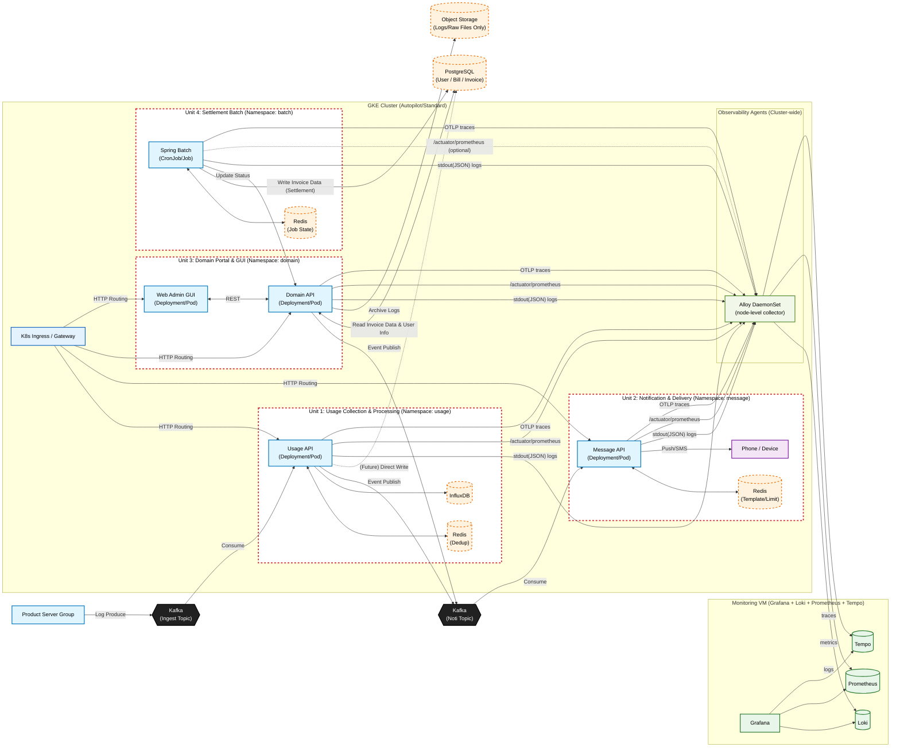
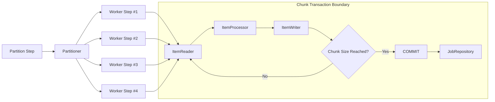
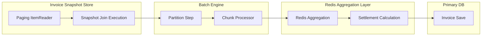
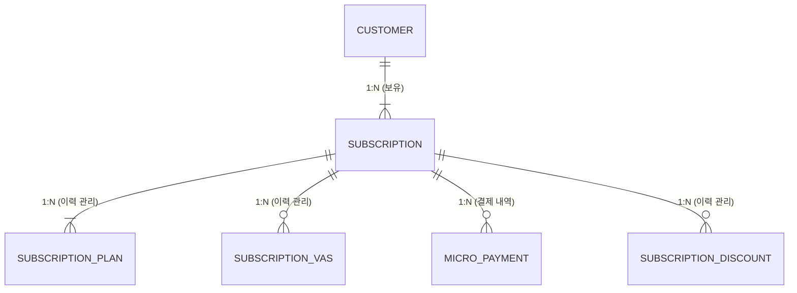
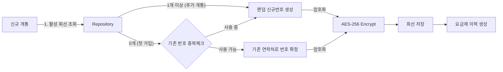
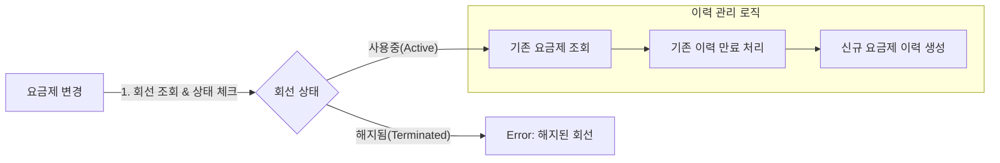
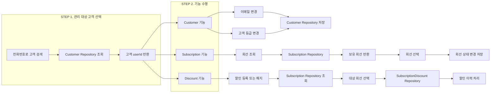

# Message Platform - 통신 서비스 메시지 플랫폼

---

## 1. 프로젝트 개요

**Message Platform**은 100만 사용자 규모의 통신 서비스를 위한 **GCP 기반 마이크로서비스(MSA) 메시지 플랫폼**입니다.

시스템은 **GKE(Kubernetes)**를 기반으로 4개의 독립적인 서비스 유닛으로 구성되며, **Kafka**를 통한 이벤트 구동 방식과 **Alloy + LGTM Stack**을 활용한 중앙 집중형 관제 시스템을 포함합니다.

### 1.1. 핵심 요구사항

통신 서비스 환경인 만큼 다음과 같은 요구사항이 존재합니다:

- 최대 **100만 개의** 회선이 **동시에 데이터 사용 가능**
- Spring Batch 기반 배치 정산 시스템 구성
- 데이터 사용 이벤트는 **수 초 단위로 지속 발생**
- 사용량이 월 기준 **50% / 80% / 100%를 처음 초과할 때만 알림**
- Kafka 재시도, Consumer 재시작 상황에서도 **중복 집계·중복 알림 방지**
- 월이 변경되면 이전 데이터는 자동으로 정리

### 1.2. 테스트 환경

- 우리 서비스는 통신 서비스 환경 구축을 목표로 하고 있습니다.
- 최대 100만 개의 서로 다른 회선에서 데이터 사용량 이벤트가 발생하는 것으로 테스트 환경을 구축하였습니다.

> 모든 회선이 항상 이벤트를 보내는 상태는 아니지만, 이론적으로는 전 회선이 동시에 사용이 가능하며 시스템은 이를 전부 감당할 수 있어야 합니다.

테스트 환경 구축을 위해 Kafka Producer를 활용해 데이터 사용량 이벤트를 인위적으로 생성합니다.

**Producer의 역할:**
- 실제 사용자 단말기의 데이터 사용을 표현
- 각 회선에 대해 임의의 사용량(delta), 이벤트 발생 시각, 고유 eventId를 usage_topic으로 지속적으로 발행

---

## 2. 기술 스택 (Tech Stack)

| 분류 | 기술 |
|------|------|
| **Language** | Java 17 |
| **Framework** | Spring Boot 3.x, Spring Batch |
| **Database** | PostgreSQL (Cloud SQL), InfluxDB |
| **Cache/Store** | Redis (Memorystore or On GKE) |
| **Message Broker** | Apache Kafka (Confluent Cloud or Strimzi) |
| **Infrastructure** | GCP (GKE, Cloud SQL, GCS) |
| **Monitoring** | Grafana Alloy + Loki + Prometheus + Tempo (LGTM Stack) |
| **Security** | AES-256-CBC Encryption |
| **ORM** | JPA (Hibernate) |
| **Build Tool** | Gradle |

---

## 3. GCP 인프라 아키텍처

### 3.1. Architecture Diagram

전체 인프라 및 데이터 흐름도는 다음과 같습니다.



### 3.2. GCP Infrastructure Overview

#### 3.2.1. Compute Engine: Google Kubernetes Engine (GKE)

서비스의 유연한 확장과 관리를 위해 **GKE**를 사용합니다.

- **Cluster Mode:** Standard (상세 제어 필요 시) 또는 Autopilot (운영 편의성 우선 시)
- **Node Pools:** 각 Unit의 리소스 특성에 맞춰 노드 풀을 분리하여 운영 가능
  - 예: Usage Unit은 High-CPU, Batch Unit은 High-Memory

#### 3.2.2. Data Storage

| 저장소 | 역할 | 용도 |
|--------|------|------|
| **Cloud SQL (PostgreSQL)** | `Shared_DB` | 사용자 정보, 청구서, 정산 내역 등 핵심 관계형 데이터 (HA 구성 권장) |
| **Google Cloud Storage (GCS)** | `Object Storage` | 대용량 로그 파일 및 계약서 원본 저장 |
| **InfluxDB (On GKE or VM)** | 시계열 데이터 | Unit 1의 트래픽 추이 저장 |
| **Redis (Memorystore or On GKE)** | 캐싱/상태 관리 | 각 Unit의 캐싱 및 상태 관리 (Unit 간 격리 권장) |

#### 3.2.3. Event Backbone

- **Apache Kafka:** `Kafka_Ingest` 및 `Kafka_Noti` 토픽을 관리
- 대용량 트래픽 버퍼링 및 서비스 간 결합도 완화 담당
- Confluent Cloud on GCP 또는 GKE 내 Strimzi 배포

### 3.3. Service Units (Namespaces)

시스템은 배포 주기와 책임 범위에 따라 4개의 Kubernetes Namespace로 격리됩니다.

| Unit | Namespace | 주요 역할 | 주요 컴포넌트 |
|------|-----------|-----------|---------------|
| **Unit 1: Usage** | `usage` | 대용량 트래픽 수집 및 가공 | `Usage API`, `Kafka Consumer`, `InfluxDB` |
| **Unit 2: Message** | `message` | 알림(SMS/Push) 발송 및 결과 처리 | `Message API`, `Redis(Rate Limit)` |
| **Unit 3: Domain** | `domain` | 통합 관리자 포털 및 사용자 기능 | `Web GUI`, `Domain API`, `Ingress` |
| **Unit 4: Batch** | `batch` | 월 단위 대용량 정산 및 청구서 생성 | `Spring Batch`, `CronJob` |

---

## 4. 데이터 사용량 관측 시스템 (100만 사용자 대응)

### 4.1. Data Flow

```
Data Usage Event Producer (회선마다 데이터 사용량 이벤트 발생)
        ↓
Kafka (usage_topic)
        ↓
Usage Aggregation Consumer (Batch)
        ↓
Redis (월별 집계 & 임계치 판단)
        ↓
Threshold(사용량 임계치) 초과 이벤트만 선별
        ↓
Kafka (notification_topic)
```

### 4.2. Kafka 설계

#### 4.2.1. usage_topic

- 모든 데이터 사용 이벤트가 유입되는 메인 스트림
- **Key: subscription_id (회선 ID)**
  - 같은 회선의 이벤트는 같은 파티션
  - 회선 단위 순서를 보장하고 집계 로직을 단순화

#### 4.2.2. Consumer

- **Batch Consumer 도입**
  - 초당 수십만 이벤트를 하나의 단위로 처리한다면 서버에 많은 부하 발생
  - 네트워크 및 Redis 호출 비용을 최소화하며 Redis 원자 연산을 batch 단위로 활용

### 4.3. 왜 Redis를 도입하였는가?

이 시스템에서 Redis는 단순 캐시가 아니라 **실시간 집계용 Main Store** 역할을 수행합니다.

#### 4.3.1. 요구되는 처리량 분석

데이터 사용량 기능 구현 시 **최악의 경우 100만 개 회선이 짧은 시간 내(예: 5초)** 데이터 사용 이벤트를 동시에 발생시키는 상황을 고려해야 합니다.

각 이벤트마다 아래의 순서에 맞는 처리가 필요합니다:
1. 월별 데이터 사용량 누적
2. 요금제 기준 사용량 대비 퍼센트 계산
3. 50% / 80% / 100% 임계치 초과 여부 판단
4. 임계치 초과 시 중복 없이 단 1회만 사용량 알림 이벤트 발행

> 이 모든 로직은 **이벤트 단위로 실시간 처리**되어야 하며, 시스템이 대용량의 트래픽을 견딜 수 있어야 합니다.

```
요구되는 처리량 -> 100만 회선 + 5초간 이벤트 발생 = 초당 약 200,000 데이터 사용량 이벤트 발생

각 이벤트 당 최소 연산:
- INCR (누적)
- GET (임계치 상태)
- SET (임계치 갱신 가능성)

초당 최소 수십만의 Read/Write 연산이 발생할 수 있음
```

#### 4.3.2. RDB를 적용한다면?

RDB에서 이 로직을 구현하려면 반드시 아래의 쿼리문들이 최소로 필요합니다:

```sql
BEGIN;
SELECT used, last_threshold
FROM usage
WHERE user_id = ?
FOR UPDATE;
--- 조회

UPDATE usage SET used = used + ?, last_threshold = ?
WHERE user_id = ?;
COMMIT;
--- 연산
```

**Problem:**
- **Row Lock:** 같은 subscriptionId 이벤트가 몰리면 대기 발생
- **RDB의 Write Amplification 문제:**
  - RDB에서 UPDATE 쿼리 1번이 실제로 하는 일:
  - Row Lock 획득 → Buffer Cache → 새로운 Row 생성 → Log(WAL) 기록 → 인덱스 업데이트
  - **논리적 연산 1번 = 물리적 작업 5~10회**

#### 4.3.3. Redis를 사용한다면?

Redis로 설계하면 위의 복잡한 연산을 **한 번의 원자적 처리**로 묶을 수 있습니다.

**1. Lua 스크립트로 여러 단계를 한 트랜잭션처럼 처리 가능**
- 누적 증가, 퍼센트 계산, 임계치 도달 판단 … 이러한 로직이 상태 전이의 형태로 처리되어야 함
- Lua 스크립트를 활용하면 위의 상태 전이에 해당되는 로직들을 하나의 트랜잭션에서 처리 가능
- 위의 로직들 플로우대로 흘러가던 중 하나라도 문제 생기면 Rollback이 가능해짐
- **동시성 이슈를 해결**

**2. 임계치 알림을 Set/Bit로 한 번만 보장 가능**
- `SET NX`, `SETBIT`: 이 원자연산들은 읽고 판단하고 쓰는 걸 한 번에 함
- 중간에 다른 요청이 끼어들 수 없기 때문에 알림을 한 번만 보내는 것을 보장할 수 있음

> **단순히 저장소 선택의 문제가 아니라, 동시성·원자성·상태 전이를 어디서 처리할 것인가에 대한 설계 문제였고, Redis는 그 요구사항을 가장 단순한 구조로 만족시킨다고 판단하여 도입 결정**

### 4.4. 월별 집계 전략 (Redis Keys)

모든 상태는 **월 단위로 분리하여 각 Key마다 TTL을 적용하여 관리**합니다.

```
월별 누적 사용량
usage:{yyyyMM}:{subscriptionId}

Kafka 이벤트 중복 방지
processed:{yyyyMM}:{subscriptionId}
→ Kafka 재시도 및 Consumer 재시작 대응을 위한 키

임계치 상태 관리
th:{yyyyMM}:{subscriptionId}
→ 값: 0 / 50 / 80 / 100 (알림 중복 전송 방지)

회선별 월 사용 가능량
limit:{subscriptionId}
→ 요금제 기반 월별 데이터 사용량 회선별로 관리하기 위한 키
```

### 4.5. 데이터 사용량 집계 및 임계치 초과 감지 전략

1. Kafka에서 **Batch로 사용량 이벤트 수신**
2. Redis에서 다음을 **원자적으로 수행** (Redis LUA 스크립트를 활용하여 회선별 사용량 집계 트랜잭션을 관리)
   - 이벤트 중복 여부 확인
   - 월별 사용량 누적
   - 사용률(percent) 계산
   - 이전 임계치 상태 조회
3. **50/80/100 중 처음 초과한 단계만 선별하여** 초과 이벤트만 데이터 사용량 알림 발송

---

## 5. 배치 시스템 (월별 정산)

본 시스템은 **월별 청구내역 생성 배치 시스템**과 **월별 청구서(정산) 생성 배치 시스템**의 설계 및 처리 흐름을 포함합니다. 대용량 데이터 처리와 장애 복구를 고려하여 **Spring Batch 기반**으로 설계되었습니다.

### 5.1. 배치를 사용하는 이유

지정된 날짜에 작업을 수행하는 기술로 스케줄러도 존재하지만, 본 프로젝트에서 배치를 선택한 가장 큰 이유는 **안전성**입니다.

### 단순 스케줄 기반 처리 vs 배치 프레임워크 기반 처리

대규모 정산 데이터를 안정적으로 처리하기 위해  
**단순 스케줄 기반 처리 방식과 Spring Batch 기반 배치 처리 방식을 비교**하였습니다.

### 비교표

| 구분 | 단순 스케줄 기반 처리<br>(Cron + JPA/JDBC) | Spring Batch 기반 배치 처리 |
|------|-------------------------------------------|------------------------------|
| 처리 대상 규모 | 소~중규모 데이터 | **대규모 데이터 (수십~수백만 건)** |
| 장애 발생 시 | 전체 재실행 필요 | **실패 지점부터 재시작 가능** |
| 상태 관리 | 애플리케이션 코드로 직접 관리 | **Job / Step 메타데이터 자동 관리** |
| 트랜잭션 관리 | 단일 트랜잭션 또는 수동 분리 | **Chunk 기반 트랜잭션 처리** |
| 중복 처리 방지 | 개발자 직접 구현 필요 | **ExecutionContext 기반 관리** |
| 운영 가시성 | 별도 로그·모니터링 구축 필요 | **운영 환경에 적합한 실행 이력 제공** |
| 확장성 | 병렬 처리 구현 난이도 높음 | **Partition / Parallel Step 지원** |


### 채택 기준

> 월말 기준 수십~수백만 건의 청구 데이터를 안정적으로 처리하고,  
> 장애 발생 시 실패 지점부터 재시작 가능한 정산 구조가 필요하므로  
> 단순 스케줄 기반 처리 대신 **Spring Batch 기반 배치 처리 방식**을 채택했습니다.


> **대용량 데이터 + 재시작 가능성**이 중요한 본 프로젝트에 적합하여 Spring Batch를 채택했습니다.

---

### 5.2. ItemReader 선택 (Paging vs Cursor)

#### 5.2.1. Cursor ItemReader
- DB 커넥션을 유지한 채 한 줄씩 조회
- 싱글 스레드에 적합
- ❌ 장시간 실행 시 DB Connection Pool 고갈 위험

#### 5.2.2. Paging ItemReader
- 데이터를 페이지 단위로 조회
- Chunk 단위로 커넥션 반환
- ✅ Partition / 멀티 스레드 처리에 적합

> 본 프로젝트에서는 **PagingItemReader**를 사용합니다.

---

### 5.3. Step vs PartitionStep

- 정산 이력 생성 및 정산서 생성은 **대용량 처리 작업**
- 단일 Step은 처리 시간이 과도하게 증가
- **PartitionStep**을 통해 데이터 범위를 분할하고 병렬 처리

> 전체 배치 수행 시간을 단축하기 위해 PartitionStep을 도입했습니다.

---

### 5.4. Partitioner 전략

#### 균등 분할 선택 이유
- 데이터 분포가 구간별로 크게 다르지 않음
- 동적 분할은 장시간 배치에 적합
- 본 프로젝트는 **균등 분할이 더 단순하고 효율적**

### 5.5. 배치 시스템 실행 구조



PartitionStep은 전체 처리 대상을 병렬 실행 가능한 단위로 분할합니다.

각 WorkerStep은 다음 구조로 독립 실행됩니다:
- ItemReader → ItemProcessor → ItemWriter 파이프라인 수행
- Chunk 단위로 트랜잭션 커밋
- StepExecution 및 JobExecution 메타데이터는 JobRepository에 기록

---

## 5.6. 월별 청구내역 생성 배치 시스템 (선행 배치)

#### 5.6.1. 개요

월별 청구내역을 **스냅샷 및 집계 데이터 형태로 사전 생성**하여  
후속 정산 배치 및 조회 시 **데이터 일관성과 성능을 보장**하는 배치 시스템입니다.

본 배치는 **Primary / Replica DB 분리 환경**을 고려하여  
읽기와 쓰기 책임을 명확히 분리한 **다단계(Step 분리) 배치 구조**로 설계되었습니다.

---

#### 5.6.2. 배치 구성 개요

| Step | 역할 | 데이터 소스 | 데이터 저장 |
|------|------|------------|-------------|
| Step 1 | 정산 대상 데이터 조회 및 요금 연산 | Replica DB | Redis (중간 집계 저장소) |
| Step 2 | 집계 결과 확정 및 영속화 | Redis | Primary DB |

---

#### 5.6.3. Step 1 – 정산내역 집계 및 중간 저장

**목적**
- 대량의 원천 데이터를 Replica DB에서 안전하게 조회
- 다중 테이블 JOIN 및 요금 연산 수행
- 연산 결과를 **중간 저장소(Redis)**에 집계 형태로 저장

**처리 내용**
- Paging + Partition 기반 조회
- 회선별 청구내역 JOIN 조회
- 요금, 할인, 총액 등 **정산 계산 로직 수행**
- 정산 단위 기준으로 Redis에 집계 저장

**설계 의도**
- Replica DB **읽기 전용 트랜잭션 유지**
- DB 쓰기 트랜잭션과 완전 분리
- 장애 발생 시 Redis 기준으로 재시작 가능

---

#### 5.6.4. Step 2 – 집계 결과 확정 및 DB 저장

**목적**
- Redis에 집계된 정산 데이터를 기준으로
- 최종 청구내역 스냅샷을 생성하고 Primary DB에 저장

**Processor 역할**
- Redis 집계 데이터 → 도메인 엔티티 변환
- 누락/이상 데이터 검증
- 최종 저장용 Snapshot Entity 생성
- Idempotent 처리 보장 (중복 저장 방지)

> 요금 계산은 Step 1에서 종료되며,  
> Step 2는 **정산 결과를 확정하고 영속화하는 단계**입니다.

---

#### 5.6.5. 전체 처리 흐름

```mermaid
flowchart LR
    %% Step 1
    subgraph ReplicaDB["Read Replica DB"]
        R1[Paging ItemReader]
        R2[Join Query Execution]
        R1 --> R2
    end

    subgraph Step1["Step 1: Aggregation Step"]
        P1[Partition & Chunk Processing]
        A1[Charge Calculation]
        RW[Redis Writer]
        P1 --> A1 --> RW
    end

    %% Step 2
    subgraph Redis["Redis"]
        RS[Aggregated Billing Data]
    end

    subgraph Step2["Step 2: Persist Step"]
        RR[Redis ItemReader]
        P2[Snapshot Entity Mapping & Validation]
        DBW[Primary DB Writer]
        RR --> P2 --> DBW
    end

    subgraph PrimaryDB["Primary DB"]
        DB[(Billing Snapshot Table)]
    end

    R2 --> P1
    RW --> RS
    RS --> RR
    DBW --> DB
```


#### 5.6.6. 설계 포인트

- 단일 Step에서 **Replica 읽기 + Primary 쓰기 혼합 금지**
- 읽기 전용 처리(Step 1)와 영속화 처리(Step 2)의 **명확한 책임 분리**
- Redis를 **중간 저장소**로 활용하여
  - 장애 발생 시 **재시작 지점 명확화**
  - 대량 처리 시 **DB 부하 분산**
- 후속 정산 배치는 **Snapshot 및 집계 데이터 기준으로 수행**
- 운영 환경에서 **Primary / Replica 트래픽 분리 보장**

---

### 5.7. 월별 청구서 생성 (정산) 배치 시스템

#### 5.7.1. 개요

월별 청구내역 Snapshot을 기반으로 정산 데이터를 집계하고 청구서를 생성하는 배치 시스템입니다.

**주요 기능:**
- (회선 ID + 청구월) 기준 데이터 집계
- Redis 기반 중간 집계
- 정산 금액 계산
- 정산 결과 기반 청구서 Entity 생성
- 결과 PostgreSQL 저장

#### 5.7.2. 처리 흐름



#### 5.7.3. Redis 사용 이유

- 정산 중간 계산 결과를 메모리 기반으로 집계하여 **대량 처리 성능 향상**
- Replica 기반 읽기(Step 1)와 Primary 기반 쓰기(Step 2)를 분리하기 위한  
  **중간 저장소 역할 수행**
- 단일 Step에서 Replica 읽기 + Primary 쓰기 혼합을 방지하여  
  **DB 역할 분리 원칙(Primary/Replica)을 운영 환경에서 보장**
- 중간 집계 결과를 Redis에 저장함으로써 **Primary DB 부하 최소화**
- 장애 발생 시 Redis에 저장된 집계 데이터를 기준으로  
  **재시작 및 재처리 구조 단순화**

#### 5.7.4. Redis 장애 대응 및 안정성 강화 방안 (추후 추가)

- Redis를 **정산 중간 저장소(비영속 데이터)**로 사용하여  
  장애 발생 시에도 Primary DB의 데이터 정합성에는 영향을 주지 않는 구조 유지
- Redis 장애 발생 시
  - Step 1(집계 Step) 중단 후 재시작 시점부터 재처리 가능
  - StepExecutionContext 및 Batch 메타데이터를 기준으로 안전한 재실행 보장
- Redis 데이터는 **정산 완료 전까지의 임시 집계 데이터**로 한정하여  
  장애 복구 시 재계산 비용을 감내 가능한 수준으로 설계

**추후 고도화 계획**
- Redis Replication 또는 Sentinel 기반 구성으로
  단일 노드 장애 시 자동 Failover 지원
- Redis 장애 감지를 위한 헬스 체크 및 알림 연동
- Redis 쓰기 실패 시
  - 즉시 배치 중단(Fail Fast)
  - Partial Commit 방지를 위한 트랜잭션 경계 명확화
- Redis 집계 데이터에 TTL을 적용하여
  장애 복구 이후 불필요한 데이터 자동 정리

> Redis는 영구 저장소가 아닌 **중간 집계 저장소**로 사용하며,  
> 장애 발생 시에도 배치 재시작을 통해 **정합성을 회복할 수 있는 구조**를 유지한다.

---

## 5.8. 추후 확장 계획

#### 5.8.1. 재시작 전략 고도화

- StepExecutionContext 기반 재시작 조건을 명확히 정의하여  
  실패 Step 및 Partition 단위 재시작 정밀도 향상
- 부분 실패(Step/Partition 단위 실패) 시에도  
  전체 재실행 없이 안전하게 복구 가능한 전략 적용
- Redis 집계 상태와 Batch 메타데이터 간 정합성 검증 로직 추가

---

#### 5.8.2. 테스트 전략

- **단위 테스트**
  - 요금 및 할인 계산 로직 검증
  - 정산내역 및 Snapshot Entity 생성 검증
- **통합 테스트**
  - Job 재시작 시나리오 검증
  - Partition 기반 병렬 처리 동작 검증
  - Redis → Primary DB 저장 흐름 검증

---

#### 5.8.3. 성능 및 조회 최적화 계획

- 월별 정산서 및 정산내역 조회 성능 향상을 위해  
  `sub_id`, `inv_month` 기준의 **복합 인덱스 추가 예정**
- 대량 조회 및 월별 조회 패턴을 고려한 인덱스 전략 지속 개선

---

#### 5.8.4. 배치 안정성 강화 전략

- Skip / Retry 정책 도입을 통해
  - 비정상 데이터로 인한 전체 배치 중단 방지
  - 일시적 오류(네트워크, 외부 의존성)에 대한 복원력 강화
- Writer 단계 실패 시
  - 트랜잭션 롤백 전략 명확화
  - Idempotent 저장 구조를 통한 중복 데이터 방지

---

#### 5.8.5. 검증 전용 배치(Job) 추가

- 선행 배치(정산내역 생성)와 후속 배치(정산서 생성) 수행 이후
  **결과 정합성을 검증하는 검증 전용 Job 추가**
- 주요 검증 항목
  - 집계 금액 합계 일치 여부
  - 정산내역 ↔ 정산서 간 데이터 누락 여부
  - 중복 데이터 존재 여부
- 검증 실패 시 알림 및 후속 조치 가능 구조 설계
---

## 6. Core Domain API

**유저 정보 관리**, **통신 서비스 가입**, **요금제 변경**, **부가서비스 관리**, **할인서비스 관리**, **소액결제 내역 처리**를 담당하는 Core 백엔드 모듈입니다. 대용량 트래픽과 데이터 환경을 고려하여 **이력 관리**와 **데이터 무결성**에 중점을 두고 설계되었습니다.

### 6.1. 핵심 도메인 구조

고객(Customer)은 여러 회선(Subscription)을 가질 수 있으며 각 회선은 요금제(PLAN), 부가서비스(VAS), 소액결제(MICRO), 할인(DISCOUNT)의 이력을 관리합니다.



### 6.2. 핵심 로직

#### 6.2.1. 신규 개통 프로세스

고객이 회선을 새로 개통할 때 **기존 사용 번호 복구**와 **신규 번호 채번**을 자동으로 판단하는 로직입니다.

**1. 유효성 검사:**
- 요청받은 고객 정보가 실제 DB에 존재하는지 확인합니다.

**2. 번호 채번 정책:**
- **메인 번호 복구:** 만약 고객이 현재 사용 중인 회선이 0개라면, 고객 정보에 등록된 연락처를 우선적으로 회선 번호로 할당하여 **쓰던 번호 그대로** 사용할 수 있게 합니다. (단, 타인이 사용 중이지 않을 경우)
- **신규 번호 생성:** 이미 회선이 있거나(투폰/서브폰), 기존 번호를 사용할 수 없는 경우, 시스템은 중복되지 않는 랜덤 전화번호를 새로 생성하여 할당합니다.

**3. 회선 생성:**
- 확정된 전화번호는 AES-256 알고리즘으로 암호화되어 DB에 저장됩니다.

**4. 초기 요금제 연결:**
- 회선 생성과 동시에, 선택한 요금제에 대한 첫 번째 이력 데이터를 관련 테이블에 생성합니다.



#### 6.2.2. 요금제 변경 프로세스

단순 업데이트가 아닌 **기존 이력을 만료시키고 새 이력을 쌓는** 방식으로 데이터의 시간적 변화를 추적합니다.

**1. 상태 및 유효성 체크:**
- 변경하려는 회선이 존재하고, 현재 해지된 상태가 아닌지 확인합니다.

**2. 기존 이력 만료:**
- SubscriptionPlan 테이블에서 현재 적용 중인 요금제 이력을 조회합니다.
- 해당 레코드의 **종료일을 현재 시점으로 업데이트**하여, 해당 요금제의 효력을 만료시킵니다.

**3. 신규 이력 생성:**
- 변경할 새로운 요금제 정보를 담은 **새로운 레코드를 INSERT**합니다.
- 이 레코드의 시작일(created_date)은 현재 시점으로 설정되어 현재 유효한 요금제가 됩니다.



#### 6.2.3. 시스템 작동 흐름도



#### 6.2.4. 고객 정보 관리 프로세스

관리자가 고객의 기본 정보를 변경할 때 수행되는 로직입니다.

1. **고객 조회:** 전화번호 검색을 통해 고객을 식별하고, 내부적으로는 userId 기준으로 관리합니다.
2. **이메일 변경:** 기존 고객 정보를 조회한 뒤 이메일을 변경하여 저장합니다.
3. **고객 등급 변경:** 고객 등급(GENERAL, VIP, VVIP)을 정책에 따라 변경하고 저장합니다.

#### 6.2.5. 회선 상태 변경 프로세스

고객이 보유한 회선의 상태를 관리자가 변경하는 로직입니다.

1. **회선 조회:** 고객이 보유한 모든 회선을 조회합니다.
2. **대상 회선 선택:** 관리자가 상태를 변경할 회선을 선택합니다.
3. **상태 변경:** 선택된 회선의 상태(사용중, 일시정지, 해지 등)를 변경하여 저장합니다.

#### 6.2.6. 할인 서비스 관리 프로세스

회선 단위로 할인 서비스를 등록하거나 해지하는 로직입니다.

1. **회선 조회:** 고객이 보유한 회선을 조회합니다.
2. **할인 대상 선택:** 할인 적용 또는 해지를 수행할 회선을 선택합니다.
3. **할인 처리:** 할인 등록 시 새로운 할인 이력을 생성하고, 해지 시 기존 할인 이력을 종료 처리합니다.

### 6.3. Why? (설계 근거)

#### 6.3.1. Customer(1) : Subscription(N) 구조의 이유

현대 사용자는 메인 스마트폰 외에도 서브 폰 등 여러 회선(Multi-Device)을 보유할 수 있습니다. 이를 `1:1`로 강제하면 데이터 중복이 발생하고 통합 관리가 불가능해집니다.

#### 6.3.2. 이력 관리의 이유

만약 이력을 관리하지 않고 현재 요금제 정보만 덮어쓰기 한다면?
- 사용자의 과거 데이터가 유실됨
- 월 중 요금제를 변경했다면 요금 추적이 어려워짐

사용자의 변경 이력을 모두 추적하여 정확하게 계산할 수 있습니다.

#### 6.3.3. AES-CBC 사용 이유

동일한 평문이라도 매번 다른 암호문이 생성되도록 하여 데이터 패턴 분석을 차단하기 위함입니다. 같은 전화번호라도 저장될 때마다 완전히 다른 암호문으로 변환되므로 개인정보를 안전하게 보호할 수 있습니다.

---

## 7. 메시지 템플릿 시스템

메시지 예약 플랫폼에서 **SMS / 이메일 템플릿을 어떻게 저장·관리할지**는 *"템플릿 구조 + 변수 치환 방식 + 버전/권한 관리"*로 나눠서 설계되었습니다.

### 7.1. 템플릿의 기본 개념

#### 템플릿이 가져야 할 요소

```
- 템플릿 ID
- 채널 (SMS / EMAIL / PUSH 등)
- 제목 (메일용)
- 본문
- 변수 정의
- 상태 (초안 / 활성 / 비활성)
- 버전
- 생성자 / 수정자
```

### 7.2. 템플릿 저장 구조 (DB 설계)

#### templates 테이블

```sql
CREATE TABLE templates (
  id BIGINT PRIMARY KEY,
  name VARCHAR(100),
  channel ENUM('SMS', 'EMAIL'),
  subject VARCHAR(200),        -- EMAIL만 사용
  body TEXT,                   -- 실제 템플릿 내용
  variables JSON,              -- 사용 변수 목록
  status ENUM('DRAFT', 'ACTIVE', 'ARCHIVED'),
  version INT,
  created_at TIMESTAMP,
  updated_at TIMESTAMP
);
```

#### body 예시

```
안녕하세요 {{user_name}}님,
{{date}}에 예약하신 {{service_name}} 일정이 있습니다.
```

#### variables 예시 (JSON)

```json
{
  "user_name": {
    "type": "string",
    "required": true,
    "description": "수신자 이름"
  },
  "date": {
    "type": "date",
    "required": true
  },
  "service_name": {
    "type": "string",
    "required": false
  }
}
```

> 이렇게 하면 **에디터에서 자동 완성 / 유효성 검사**가 가능합니다.

### 7.3. 변수(placeholder) 설계 방식

#### 권장 문법

```
{{variable_name}}
```

**이유:**
- 직관적
- 대부분의 템플릿 엔진과 호환
- 프론트/백엔드 모두 처리 쉬움

#### 피하는 게 좋은 방식

```
{0}, {1}       -- 가독성 나쁨
${userName}    -- 채널/언어별 충돌 가능
```

### 7.4. 템플릿 렌더링(치환) 방식

#### 서버에서 처리하는 경우 (권장)

```javascript
function renderTemplate(template, data) {
  return template.replace(/{{(.*?)}}/g, (_, key) => {
    if (!(key in data)) throw new Error(`Missing variable: ${key}`);
    return data[key];
  });
}
```

#### 사용 예

```javascript
renderTemplate(
  "안녕하세요 {{user_name}}님",
  { user_name: "민수" }
);
// 결과: "안녕하세요 민수님"
```

### 7.5. 템플릿 버전 관리 전략

#### 운영에 필수

```
- 템플릿 수정 ≠ 기존 템플릿 덮어쓰기
- 항상 새 version 생성
- 예약된 메시지는 특정 version을 참조
```

#### 구조 예시

```
Template A v1 → 이미 예약된 메시지
Template A v2 → 신규 예약에만 적용
```

> **예약 메시지 테이블에는 template_id + version을 저장**

### 7.6. 채널별 템플릿 분리 전략

**옵션 1: channel 컬럼으로 구분 (단순)**
- SMS / EMAIL 차이 크지 않을 때

**옵션 2: 테이블 분리 (확장성 좋음)**
```
templates
template_sms
template_email
```
- EMAIL은 HTML, 첨부파일, 헤더 등이 추가되기 때문

### 7.7. 에디터 UX를 위한 추가 설계

#### 템플릿 에디터에서 제공하면 좋은 기능

- 사용 가능한 변수 리스트 자동 표시
- 변수 클릭 → 본문에 삽입
- 미리보기 (샘플 데이터 기반)
- SMS 글자 수 계산 (80/90/140byte 등)
- 필수 변수 누락 시 저장 불가

### 7.8. 예약 메시지와의 연결 구조

```
예약 메시지
 ├─ template_id
 ├─ template_version
 ├─ variables_value (JSON)
```

#### 예시

```json
{
  "user_name": "민수",
  "date": "2026-01-10",
  "service_name": "건강검진"
}
```

> **템플릿은 고정, 데이터만 바뀜** → 재사용 극대화

### 7.9. 한 줄 요약 설계 가이드

> **템플릿 = 고정된 문장 + 명시적인 변수 정의 + 버전 관리**

이 구조면:
- 예약 메시지 안전
- 에디터 UX 좋음
- 채널 확장 쉬움
- 운영 중 수정 리스크 최소화

---

## 8. Observability 전략 (Alloy + LGTM)

서비스의 안정성을 위해 애플리케이션 클러스터와 모니터링 시스템을 분리하는 전략을 채택했습니다.

### 8.1. Architecture

- **Collector (Inside GKE):** **Grafana Alloy**가 DaemonSet으로 모든 노드에 배포되어, Pod의 로그, 메트릭, 트레이스를 수집합니다.
- **Storage & UI (External VM):** GKE 외부의 별도 인스턴스(Monitoring VM)에서 데이터를 저장하고 시각화합니다. 이는 GKE 장애 시에도 모니터링 시스템이 생존하여 원인을 분석할 수 있게 합니다.

### 8.2. Tech Stack (LGTM)

| 구성요소 | 역할 |
|----------|------|
| **L**ogs: **Loki** | JSON 로그 수집 및 쿼리 |
| **G**raphs: **Grafana** | 통합 대시보드 |
| **T**races: **Tempo** | 분산 트레이싱 (OTLP 기반) |
| **M**etrics: **Prometheus** | Spring Boot Actuator 메트릭 수집 |

### 8.3. Telemetry Flow

1. **Apps:** JSON 포맷 로그 출력, Prometheus 엔드포인트 노출, OTLP Trace 전송
2. **Alloy (Agent):** 노드 레벨에서 데이터 수집 → 메타데이터(Pod Name, Namespace 등) 태깅 → Monitoring VM으로 전송
3. **Monitoring VM:** 각 저장소(Loki/Prom/Tempo)에 적재 및 Grafana 시각화

---

## 9. Key Data Flows

### 9.1. 사용량 수집 (Usage Flow)

```
Product → Kafka(Ingest) → Usage API → Redis/InfluxDB
```

- 외부 상품 서버에서 발생한 로그는 Kafka를 통해 비동기로 유입되어, 트래픽 폭주 시에도 시스템을 보호합니다.

### 9.2. 알림 발송 (Notification Flow)

```
Usage/Domain API → Kafka(Noti) → Message API → Phone
```

- 사용량 경고(Unit 1)나 서비스 알림(Unit 3)은 Kafka 이벤트를 통해 `Message API`로 전달됩니다.

### 9.3. 정산 및 청구 (Billing Flow)

```
Batch → Shared DB(Write) ↔ Domain API(Read)
```

- **Batch Unit**이 월별 정산을 수행하여 DB에 청구서(Invoice) 데이터를 기록하면, **Domain Unit**은 이를 조회하여 사용자에게 제공합니다.

---

## 10. Deployment & Operations

### 10.1. CI/CD

- 각 Unit(Namespace)별로 독립적인 파이프라인 구축 권장
- GitOps with ArgoCD or GitHub Actions

### 10.2. HPA (Auto-scaling)

| 서비스 | 스케일링 기준 |
|--------|---------------|
| `Usage API` | CPU 및 Kafka Lag 기반 스케일링 |
| `Message API` | Kafka Lag 기반 스케일링 |
| `Domain API` | CPU 및 Memory 기반 스케일링 |

### 10.3. Security

- Namespace 간 네트워크 정책(Network Policy) 적용으로 불필요한 통신 차단
- Secret 관리는 Kubernetes Secret 또는 GCP Secret Manager 연동
- 개인정보는 AES-256-CBC 암호화

